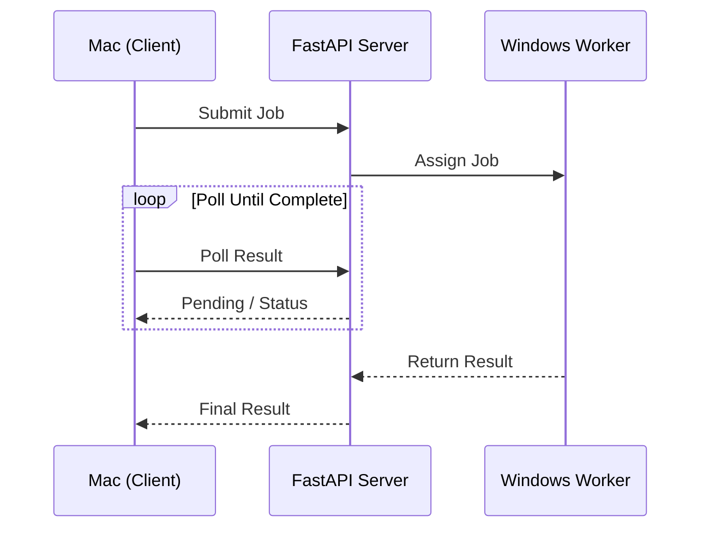

# GPU Pod — Remote GPU Access for Everyone

> **SigNoz Hackathon 2026 — Track 3 (OpenTelemetry/Python)**

## Problem Statement

GPUs are expensive and unevenly distributed. A developer might have a Mac with no GPU, while a friend or teammate has a Windows laptop with an NVIDIA GTX 1650 sitting idle. Running AI workloads, model inference, or even simple tensor computations becomes impossible without local GPU access.

**GPU Pod solves this** by creating a lightweight peer-to-peer GPU sharing layer — anyone with a GPU can offer it, anyone who needs compute can use it, all connected through a simple coordinator with **full observability via SigNoz**.

---

## What it does

```
┌─────────────────────────────────────────────────────────┐
│                     Your Network                         │
│                                                          │
│   ┌──────────┐    submit job     ┌──────────┐           │
│   │   Mac    │ ────────────────▶ │  Server  │           │
│   │ (User)   │                   │ (FastAPI)│           │
│   │ No GPU   │ ◀──── result ──── │  SQLite  │           │
│   └────┬─────┘                   └────┬─────┘           │
│        │                             │                  │
│   ┌────▼─────────────────────────────▼──────┐           │
│   │          SigNoz (Docker)                │           │
│   │   Traces · Logs · Metrics · Alerts      │           │
│   │   OTLP gRPC @ localhost:4317            │           │
│   └─────────────────────────────────────────┘           │
│                                                          │
│   ┌──────────┐   heartbeat + assign    ┌──────────┐     │
│   │ Windows  │ ◀────────────────────── │  Worker  │     │
│   │ Laptop   │ ────── execute ────────▶ │ (PyTorch)│     │
│   │ GTX 1650 │   matrix multiply       │  CUDA    │     │
│   └──────────┘                         └──────────┘     │
└─────────────────────────────────────────────────────────┘
```

### Sequence Diagram (Mermaid)



Two roles emerge naturally:

| Role | Who | What they do |
|------|-----|--------------|
| **GPU Provider** | Someone with a GPU (Windows laptop) | Runs the worker — registers, heartbeats, executes compute jobs |
| **GPU User** | Someone who needs compute (Mac) | Submits jobs, picks matrix size, sees available GPUs, gets results |

No Docker on the GPU machine, no Kubernetes, no cloud dependency. Just Python, PyTorch, and your local network.

---

## How SigNoz Observability is Built In

Every single component is instrumented with OpenTelemetry and sends data to SigNoz via OTLP gRPC (`localhost:4317`). This is not an afterthought — observability is baked into the core communication flow.

### Service Map

| SigNoz Service | Component | What's Traced |
|----------------|-----------|---------------|
| `gpu-pod-server` | FastAPI coordinator | Every HTTP endpoint (`register-worker`, `heartbeat`, `submit-job`, `result`), background sweeper, job assignment logic |
| `gpu-pod-worker` | GPU worker | Registration, heartbeat loop, job execution (matrix multiply), result submission |
| `gpu-pod-client` | Desktop GUI | Connection flow, job submission from user mode, worker lifecycle in provider mode |

### Traces (Distributed Tracing)

Every meaningful operation creates a span with rich attributes:

```
Service: gpu-pod-server
Span:    POST /submit-job
  ├── job.id        = "a1b2c3d4"
  ├── job.type      = "compute"
  ├── matrix.size   = 16384
  └── Log: "job submitted"

Service: gpu-pod-worker
Span:    worker.execute_job
  ├── job.id        = "a1b2c3d4"
  ├── job.type      = "compute"
  ├── matrix.size   = 16384
  ├── worker.gpu    = "NVIDIA GeForce GTX 1650"
  ├── compute.tflops = 2.67
  └── Log: "[WORK] Multiplying 16384x16384 matrices on GPU..."
```

### Logs (All messages in one place)

Every `print()` and log statement from every component is forwarded to SigNoz:

```
2026-07-26 22:00:28  [gpu-pod-client]  job submitted from client
2026-07-26 22:00:21  [gpu-pod-client]  connected to server
2026-07-26 22:00:03  [gpu-pod-server]  OTel initialised
2026-07-26 21:58:54  [gpu-pod-worker]  [OK] Registered | ID: ee264f6b | GPU: NVIDIA GeForce GTX 1650
2026-07-26 21:58:52  [gpu-pod-client]  [START] Worker started
2026-07-26 22:00:31  [gpu-pod-worker]  [JOB] 55482209 | Type: compute
2026-07-26 22:00:38  [gpu-pod-worker]  [DONE] 2.67 TFLOPS
2026-07-26 22:00:38  [gpu-pod-server]  [RESULT] Job 55482209 → COMPLETED
```

Filter by service, search by job ID, correlate logs with traces — all in SigNoz.

### Metrics (Quantitative)

| Metric | Type | Description |
|--------|------|-------------|
| `jobs.total` | Counter | Total jobs submitted to server |
| `jobs.completed` | Counter | Successful jobs |
| `jobs.failed` | Counter | Failed jobs |
| `workers.active` | UpDownCounter | Currently active workers |
| `jobs.queue_depth` | UpDownCounter | Pending jobs in queue |
| `worker.jobs.executed` | Counter | Jobs executed per worker |
| `worker.job.duration` | Histogram | Execution time per job (seconds) |
| `client.jobs.submitted` | Counter | Jobs submitted from client |

### Key SigNoz Features Utilized

- **Distributed Tracing** — follow a job from submission → assignment → execution → result
- **Logs** — all application logs centralised with service-level filtering
- **Metrics** — job count, queue depth, worker activity, execution durations
- **Service Map** — visualise communication between client, server, and worker
- **Span Attributes** — drill down by job ID, matrix size, GPU model, TFLOPS

---

## Tech Stack

| Layer | Technology |
|-------|-----------|
| **Coordinator** | FastAPI + SQLite + Uvicorn |
| **GPU Worker** | Python + PyTorch + CUDA |
| **Desktop Client** | Python + CustomTkinter |
| **Observability** | OpenTelemetry → SigNoz (ClickHouse + PostgreSQL) |
| **OTel Exporter** | OTLP gRPC (`opentelemetry-exporter-otlp-proto-grpc`) |
| **Auto-instrumentation** | `opentelemetry-instrumentation-fastapi`, `opentelemetry-instrumentation-logging` |
| **Container Runtime** | Docker (SigNoz only) |
| **Package Manager** | `uv` (Python) |
| **Protocol** | REST/JSON over HTTP |

---

## Quick Start

### 0. Start SigNoz (once)

```bash
# Requires Docker. Start SigNoz observability stack:
castingcast

# SigNoz UI: http://localhost:8080
# OTLP gRPC: localhost:4317
```

All three components automatically send traces, logs, and metrics to SigNoz.

### 1. Start the server (on your Mac)

```bash
cd server
uv sync
uv run python main.py
```

### 2. Start the worker — two options (on Windows)

**Option A — Desktop GUI (recommended):**

```powershell
cd client
uv venv --python 3.13
.venv\Scripts\activate
uv sync
set GPU_POD_SERVER_URL=http://<mac-ip>:8000
uv run python main.py
```

Click **"I'm a GPU Provider"** → Start Worker.

**Option B — Headless worker:**

```powershell
cd worker
uv venv --python 3.13
.venv\Scripts\activate
uv sync
set GPU_POD_SERVER_URL=http://<mac-ip>:8000
python worker.py
```

### 3. Launch the client (on your Mac)

```bash
cd client
uv sync
uv run python main.py
```

Enter the server IP, Connect, then **"I'm a GPU User"**.

---

## OpenTelemetry — SigNoz

| Component | Service name | Traces | Logs | Metrics |
|-----------|-------------|--------|------|---------|
| **Server** | `gpu-pod-server` | FastAPI endpoints, job lifecycle | All server logs | Job count, queue depth, active workers |
| **Worker** | `gpu-pod-worker` | Register, heartbeat, job execution | Worker logs | Jobs executed, duration histogram |
| **Client** | `gpu-pod-client` | Connect, submit, provider actions | GUI actions | Jobs submitted |

All data is sent via OTLP gRPC to `localhost:4317`. Every span captures:
- Service name + version
- Job IDs, worker IDs, matrix sizes
- GPU model and TFLOPS
- Success/failure with error details

**View in SigNoz:** http://localhost:8080 → Services → pick a service → Traces / Logs / Metrics

---

## What's included

| Path | What it does |
|------|--------------|
| `server/main.py` | FastAPI coordinator + OTel instrumentation |
| `worker/worker.py` | Standalone GPU worker + OTel instrumentation |
| `client/main.py` | Desktop GUI entry point + OTel |
| `client/client/app.py` | Connect/Provider/User dasboards |
| `client/client/worker.py` | Worker engine for GUI Provider mode |
| `client/client/gpu_utils.py` | GPU detection helpers |
| `gpu_pod_otel.py` | Shared OTel init for all components |
| `casting.yaml` | SigNoz deployment config (Docker Compose) |

## Environment variables

| Variable | Default | Used by | Purpose |
|----------|---------|---------|---------|
| `GPU_POD_SERVER_URL` | `http://localhost:8000` | Worker, Client | Where the coordinator lives |
| `GPU_POD_WORKER_NAME` | `gpu-worker` | Worker | Human-readable worker name |
| `OTEL_EXPORTER_OTLP_ENDPOINT` | `http://localhost:4317` | All (SigNoz) | OTLP gRPC endpoint |
| `GPU_POD_ENV` | `development` | Server | Deployment environment tag |

## Tips

- Both devices need to be on the same Wi-Fi
- Find your Mac's IP: `ipconfig getifaddr en0`
- Worker auto-assigns jobs on each heartbeat (every 5s)
- SigNoz retains traces, logs, and metrics in ClickHouse
- Check dead workers with: `python client.py workers`
